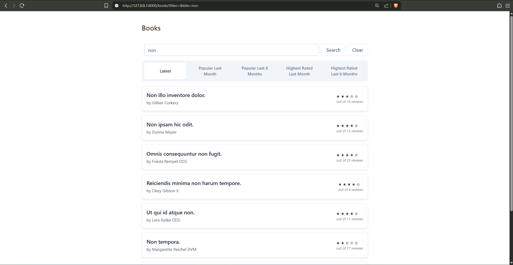
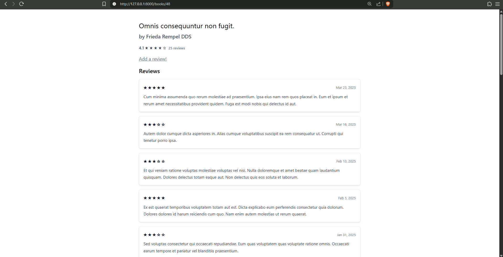
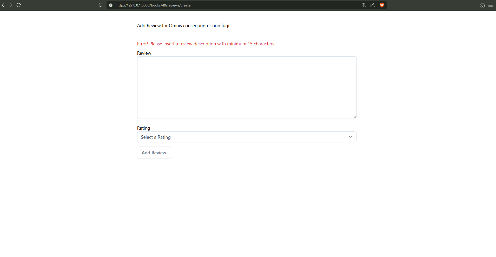

# Fórum sobre Crítica de Livros

Um projeto de site de resenhas de livros, que hospeda diferentes críticas de livros com suas próprias avaliações feitas por usuários.

### Pagina Inicial / HOME


### Críticas do Livro


### Adicionar Review



## Sobre o Projeto

Este projeto consiste em um site de críticas a livros fictícios, permitindo que cada usuário adicione seus próprios comentários e atribua uma pontuação a cada livro.

O sistema foi desenvolvido utilizando o framework Laravel e realiza alterações dinâmicas em um banco de dados MySQL.

Trata-se de um dos meus primeiros projetos utilizando o ecossistema Laravel.

## Tecnologias Utilizadas

- PHP
- Laravel
- HTML5
- CSS3
- TAILWINDCSS
- MYSQL

## Instalação

### Clone o projeto
`git clone https://github.com/JoseClaudiolima/Book-Review-Laravel.git`

`cd Book-Review-Laravel`

### Instale as dependências
`composer install`

### Copie o arquivo de ambiente
`cp .env.example .env`

### Gere a chave da aplicação
`php artisan key:generate`

### Configure o banco de dados no arquivo .env
```env
# Exemplo
DB_CONNECTION=mysql
DB_HOST=127.0.0.1
DB_PORT=3306
DB_DATABASE=clone-book-review
DB_USERNAME=root
DB_PASSWORD=
```

### Rode as migrations
`php artisan migrate`

### Inicie o servidor
`php artisan serve`

## Licença

Este projeto está licenciado sob a Licença MIT. Veja o arquivo [LICENSE](LICENSE) para mais detalhes.

## Contato

Para mais informações, entre em contato através de [jose.c.lima.sp@gmail.com](mailto:jose.c.lima.sp@gmail.com).
